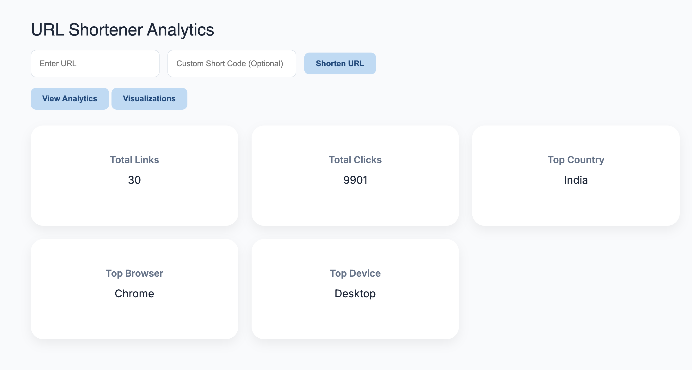
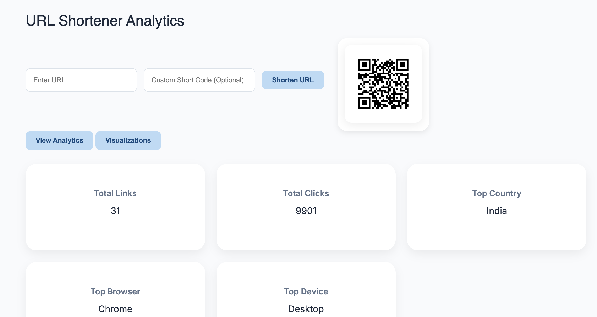
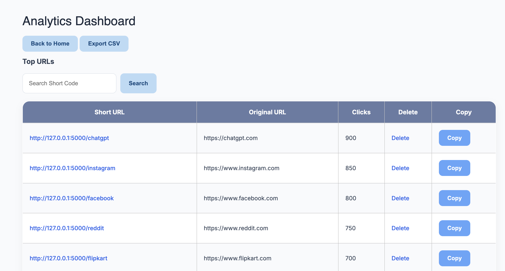
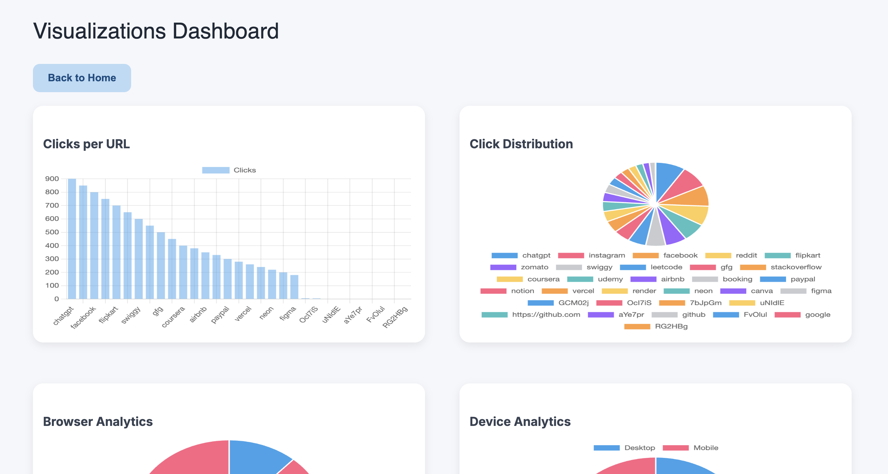

# URL Shortener Analytics

A Flask-based URL Shortener and Analytics Platform that allows users to create custom short URLs, generate QR codes, track clicks, and visualize analytics through interactive charts.

## Features

- URL Shortening
- Custom Short Codes
- QR Code Generation
- Click Tracking
- Country Analytics
- Browser Analytics
- Device Analytics
- Search Functionality
- CSV Export
- Interactive Visualizations
  - Bar Chart
  - Pie Chart
  - Doughnut Chart

## Tech Stack

### Frontend
- HTML
- CSS
- JavaScript

### Backend
- Python
- Flask

### Database
- PostgreSQL

### Libraries Used
- psycopg2
- qrcode
- Pillow
- pandas
- Chart.js

---

## Project Structure

```text
URL-Shortener-Analytics/
│
├── static/
│   ├── qr/
│   └── style.css
│
├── templates/
│   ├── index.html
│   ├── analytics.html
│   ├── visualizations.html
│   └── dashboard.html
│
├── app.py
├── database.py
├── requirements.txt
└── README.md
```

---

## Screenshots

### Home Page



### QR Code Generation



### Analytics Dashboard



### Visualizations Dashboard



---

## Installation

```bash
git clone https://github.com/Sahasra2006/URL-Shortener-Analytics.git

cd URL-Shortener-Analytics

pip install -r requirements.txt

python app.py
```

---

## Database Setup

Create a PostgreSQL database:

```sql
CREATE DATABASE url_analytics;
```

Update database credentials in `database.py`.

---

## Future Enhancements

- User Authentication
- Cloud Deployment
- Real-Time Analytics
- REST API Support
- Advanced Dashboard
- User Profiles

---

## Author

**Sahasra Pottabathina**
B.Tech Computer Science Engineering
Lovely Professional University
